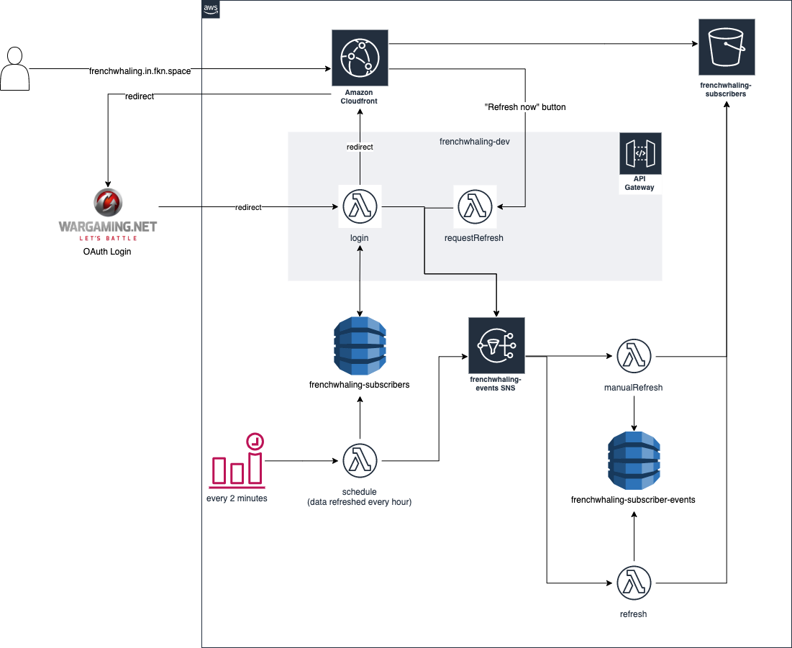

# frenchwhaling

Frenchwhaling is a website for players to track progress on the World of Warships 0.8.6 "French Destroyers" event.
It has been modified to allow other resources as well, the frontend is currently skinned for the 0.8.11 Snowflake event.

## Architecture

The architecture is built on a serverless project. Users navigate to a single page application, and then have to
log in to their realm on the Wargaming website.
After they log in, they take a detour through a lambda function that will validate the returned access token and store it
in a DynamoDB table. The lambda further generates a JWT to be used for further requests to the API gateway. This is done to
mask away the actual accessToken in case a user shares their URL.

After the token is validated, the login function triggers a manual refresh for a new subscriber. The user is redirected
back to the single page application.

The redirect URL is built with several query parameters:

`DOMAIN/?isNew={bool}&success={bool}&token={jwt}&dataURL=DOMAIN/data/{accountId}/{xid}{xid}.json`

`isNew`: whether the person is a new subscriber
`success`: whether the login was successful
`token`: the jwt
`dataURL`: the data url for a subscribers data

### Refreshing

There are two ways of getting data refreshed. One is a manual "Refresh now" button on the frontend, and the other is through automated data renewal
every hour.

#### Manual Refresh

A manual refresh can be triggered from the frontend by clicking on a button. This is possible every 10 minutes. Using this method will not skip an automated renewal.
Manual refresh triggers are sent to a SNS topic for renewals. The refresh function is explained below.
The frontend will poll the data in the background for 60 attempts  before giving up.

#### Automated Refresh

Every 2 minutes, a `schedule` lambda is called. This lambda function queries the subscribers DynamoDB table and checks when they were last scheduled.
If the data is older than one hour, a refresh event is sent to the SNS topic and the DynamoDB item is updated.

#### Refresh logic

The refresh logic is built in to the `refresh` lambda function. The `manualRefresh` and `refresh` lambda use the same code, but having separate functions
with filters applied to their SNS trigger allows me to prioritize manualRefreshes over automated refreshes, as manual refreshes usually mean
either a new subscriber or a person waiting to update their data.

The refresh logics works the following way:

1. Pull subscriber data from S3
1. Pull "Ships in Port" from the Wargaming API
1. Pull "Battle statistics" from the Wargaming API
1. Check for ships that are now in port that were not before and send a `ShipAddition` event
1. Check if the last battle of each ship is newer than before and if that was a win
1. If it is a win, send a `ResourceEarned` event and update the S3 data.
1. Save the data back to S3

### Wargaming API Interaction

When using the Wargaming API, you are limited to 10req/s. To resolve this issue with frenchwhaling, the `refresh` and `manualRefresh` functions
are limited in how many concurrent executions are allowed.
The Wargaming API is not the fastest in the world, so one API call takes a little less than a second for the methods I am using. This way it was easy
to set concurrency limits on the lambda functions.
